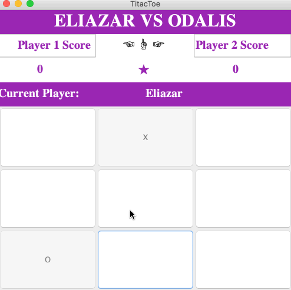

# Project  - *TicTacToe*

**TicTacToe**  Play With Friends! (Improve The Game However you want!).

Submitted by: **Eliazar Contreras**

## User Stories

features are implemented:

* [x] Players can enter their names to be display in the screen.

## Video Walkthrough

Here's a walkthrough of implemented user stories:

GIF created with [LiceCap](http://www.cockos.com/licecap/).

## License

    Copyright [2020] [Eliazar Contreras]

    Licensed under the Apache License, Version 2.0 (the "License");
    you may not use this file except in compliance with the License.
    You may obtain a copy of the License at

        http://www.apache.org/licenses/LICENSE-2.0

    Unless required by applicable law or agreed to in writing, software
    distributed under the License is distributed on an "AS IS" BASIS,
    WITHOUT WARRANTIES OR CONDITIONS OF ANY KIND, either express or implied.
    See the License for the specific language governing permissions and
    limitations under the License.
